# Getting Starting with Azure Blogging

This post will cover the following topics:

- [Getting Starting with Azure Blogging](#getting-starting-with-azure-blogging)
    - [Introduction - Installing GoHugo Framework](#introduction---installing-gohugo-framework)
  - [Create a GitHub Repository](#create-a-github-repository)
    - [Initialise Hugo Framework](#initialise-hugo-framework)
    - [Customising the Hugo with a Theme.](#customising-the-hugo-with-a-theme)
    - [Content Creation Time!](#content-creation-time)
    - [Creating a new post](#creating-a-new-post)
  - [Pre-Azure step - commit to GitHub](#pre-azure-step---commit-to-github)
  - [Creating Resource Group](#creating-resource-group)
  - [Creating the Azure Static Web App](#creating-the-azure-static-web-app)
  - [Adding a Custom Domain to the Static Web App](#adding-a-custom-domain-to-the-static-web-app)
- [Conclusion](#conclusion)

> [!WARNING]
> This guide assumes that Git and VSCode is already installed locally.

> [!NOTE]
> Software Package Versions from time of post: \
> <br>
> winget: v1.8.1911 \
> Windows Terminal: 1.21.2361.0 \
> PowerShell: 7.4.5 \
> VS Code: 1.93.0

Manual Installation of Visual Studio Code and Git.

```
$AppList = @('Git.Git','Microsoft.VisualStudioCode')
ForEach ($App in $AppList) {
winget install --scope machine --exact $App
}
```

Manual Installation of Visual Studio Code and Git and PowerShell 7

```
$AppList = @('Git.Git','Microsoft.VisualStudioCode','Microsoft.PowerShell')
ForEach ($App in $AppList) {
winget install --scope machine --exact $App
}
```

> [!IMPORTANT]
> Once the packages have been installed, you will need to restart the terminal session for the changes to take effect.

### Introduction - Installing GoHugo Framework

Firstly we need to ensure that the Hugo Framwork is installed on your local machine. This is a static site generator that will allow us to create a blog site that can be hosted on Azure. to do this we can use the following command:

```
winget install --exact Hugo.Hugo.Extended
```

Once we have installed Hugo, next we need to create a GitHub Repository to store our Hugo site. We will be using this repository to deploy our site to Azure Static Web Apps. So to [Github](https://github.com)!

## Create a GitHub Repository

```
static-web-app-demo
```


Once the repository has been created we can then clone the new repo to the local machine.


> For this example the working directory will be C:\Code \
> to create this folder using powershell we can use the following command:

```powershell
New-Item -ItemType 'Directory' -Path 'C:\Code'
Set-location -Path 'C:\Code'
```

Execute Git Clone!

> This will create a local folder inside of C:\Code called static-web-app

```
git clone https://github.com/builtwithcaffeine/static-web-app-demo.git
```

### Initialise Hugo Framework

[Hugo :: Quick Start Help](https://gohugo.io/getting-started/quick-start/)

> From the working directory C:\Code

```
hugo new site c:\code\static-web-app-demo --force
```

Example of new site creation.
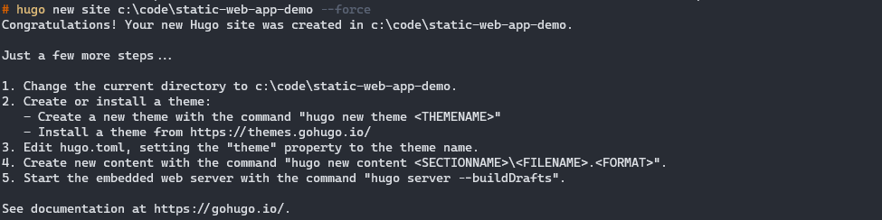

So, we technically have a site deployed, However if you were to look at it from your local machine it would'nt look very nice. First we need to change the local directory to be inside the hugo site.

```
Set-location -Path 'C:\Code\static-web-app-demo'
```

Then Launch the Hugo Server

```
hugo server
```


Open a web browser and nativate to [http://localhost:1313](http://localhost:1313)

As I said, It's not very pretty. So lets add a theme to the site.

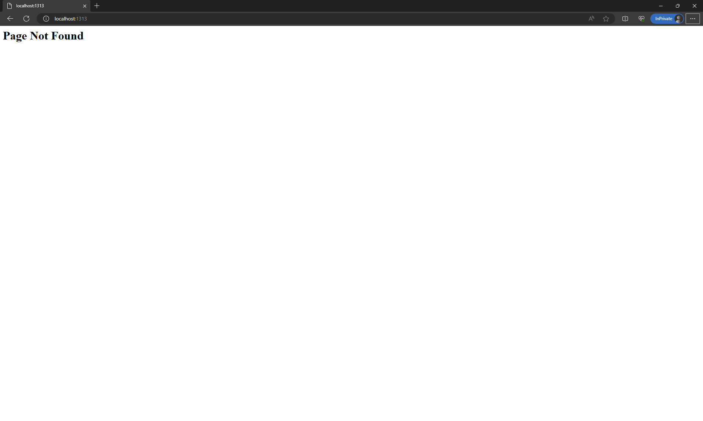

### Customising the Hugo with a Theme.

[Hugo :: Themes](https://themes.gohugo.io/) \
[Bilberry Theme :: GitHub](https://github.com/Lednerb/bilberry-hugo-theme)

For this example I'm going to demonstrate how to use the [bilberry-hugo-theme](https://themes.gohugo.io/themes/bilberry-hugo-theme/) theme.

First we need to stop the local Hugo Server instance. `CTRL + C` \
From the Bilberry Git Repo, We are going to use Install Method #2 `Git SubModule`

Ensure that you are in the correct working directory, This should be:

```
Set-Location -Path 'C:\Code\static-web-app-demo
```

Now we can clone the theme into the Static Web App folder.

```
git submodule add https://github.com/Lednerb/bilberry-hugo-theme.git themes/bilberry-hugo-theme
```

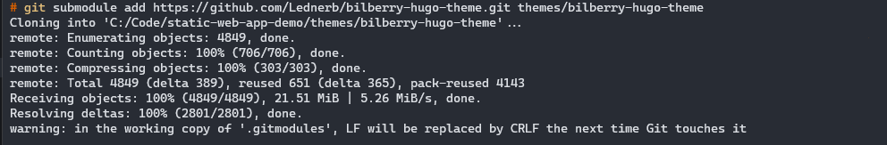

Once the theme has been downloaded we need to update the hugo.toml file to use the new theme.

A default hugo.toml file would look like

```toml
baseURL = 'https://example.org/'
languageCode = 'en-us'
title = 'My New Hugo Site'
```

An updated hugo.toml file would look like

```toml
baseURL = 'https://hugo-demo.az.builtwithcaffeine.cloud'
languageCode = 'en-us'
title = 'Static Web App Demo Site'
theme = "bilberry-hugo-theme/v4"
```

Now lets check the site again

```
hugo server
```


Open a web browser and nativate to [http://localhost:1313](http://localhost:1313)


### Content Creation Time!

So hugo has two options for content creation. Either Pages or Posts.
There is some really good documentation provided from Hugo on Content creation and organisation, which can be found here > [Click Me!](https://gohugo.io/content-management/organization/)

```
.
└── content
    └── about
    |   └── index.md  // <- https://example.org/about/
    ├── posts
    |   ├── firstpost.md   // <- https://example.org/posts/firstpost/
    |   ├── happy
    |   |   └── ness.md  // <- https://example.org/posts/happy/ness/
    |   └── secondpost.md  // <- https://example.org/posts/secondpost/
    └── quote
        ├── first.md       // <- https://example.org/quote/first/
        └── second.md      // <- https://example.org/quote/second/
```

^ this snippet has been taken direct from the Hugo Website, Just for reference.

So from a VSCode perspective, this is how I personally like to organise my content.


### Creating a new post

To create a new post we can use the following command:

``` bash
hugo new posts/2024-02/welcome-to-my-blog.md
```


This will create a new post in the posts folder, with the date and title of the post.


## Pre-Azure step - commit to GitHub

Ok! So we have the sample site ready to use, now we need to commit the changes to GitHub. Ensure that the hugo site is not running locally `CTRL + C` and then we can commit the changes to GitHub.

```bash
git add * && git commit -m "Static Web App Upload" && git push
```

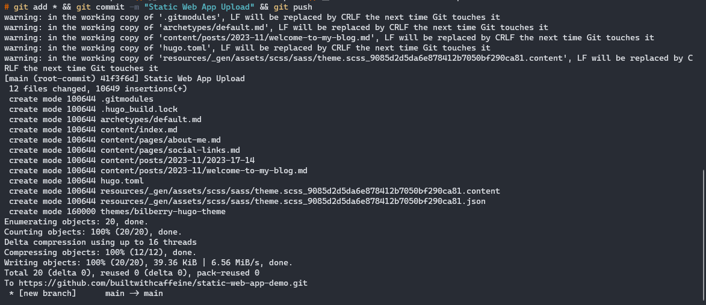

## Creating Resource Group

From the Azure Portal, create a new resource group


## Creating the Azure Static Web App

Now that we have a Hugo site, we can now create the Azure Static Web App.
From the Azure portal, we need to create a resource group which will contain the Static Web App and later on the DNS Zone for the website.

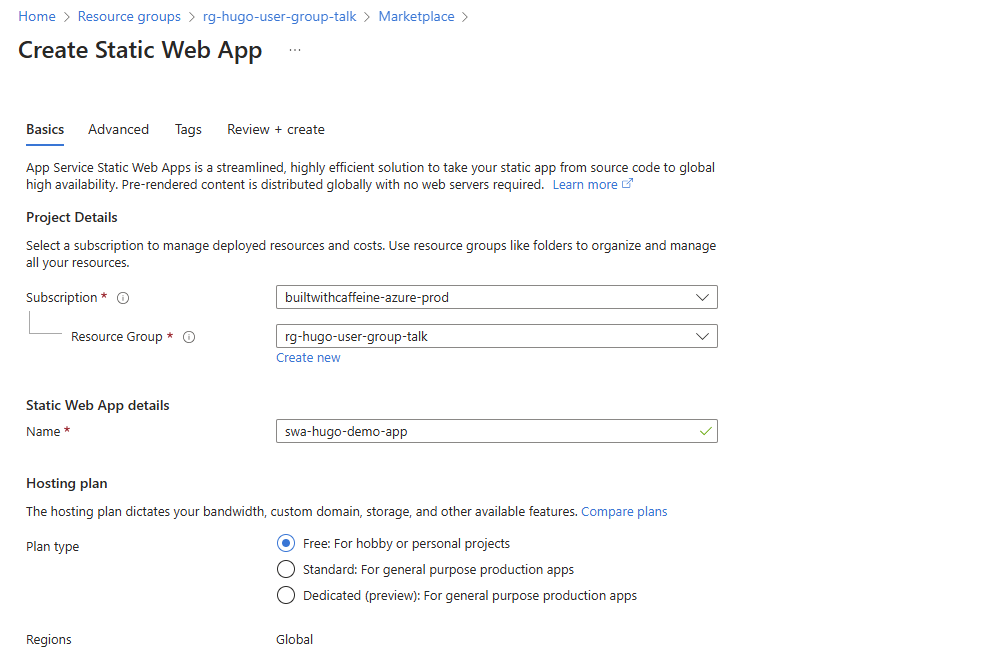

This is the important part, If you get these settings wrong the site wont deploy.
For this example we are going to use GitHub as the source control, and the repository we created earlier in this guide. and the Build Preset will be Hugo.

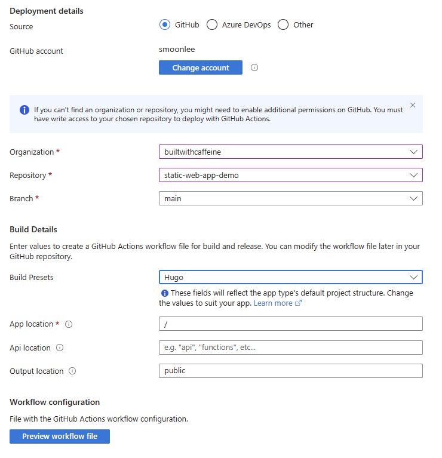

Pre-Flight checks, before the static web app is deployed to Azure.


As we can see here the deployment of the Static Web App is super fast and has only taken a couple of minutes to complete.

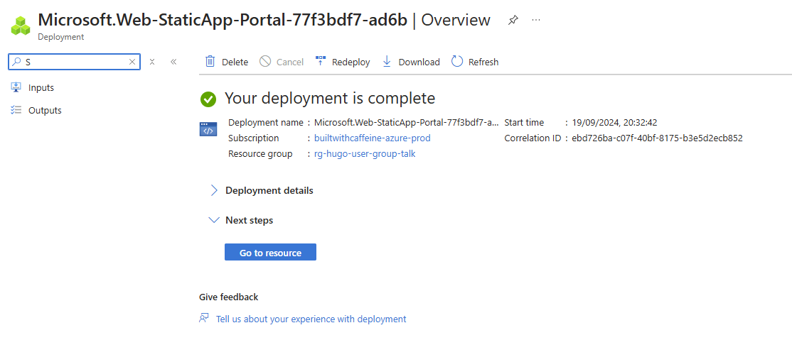

Once the Static Web App has been created it pushed a yaml file to the GitHub repository which contains the build and deployment instructions for the site.
You can view this under the GitHub Action tab within the repository.

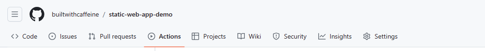

From here we can see the initial action has completed and the site has been deployed.


## Adding a Custom Domain to the Static Web App

> [!WARNING]
> Just as a general heads up, If the Static Web App has been deployed with a custom domain, the site initially will look broken as the url links will use the custom domain. - Which will not YET be configured.

For this example we already have a DNS Zone in Azure which we can use to add the custom domain to the Static Web App. for this example the DNS zone is: `az.builtwithcaffeine.cloud`

The Website URL we configured in the hugo.toml file is: `https://hugo-demo.az.builtwithcaffeine.cloud`

to configure a customer domain, from the Static Web App resource, select the Custom Domains tab and then click on the Add Custom Domain button then Custom domain on Azure DNS.


then add the url prefix `hugo-demo` - this will add the subdomain to the DNS Zone and configure the CNAME record for the Static Web App. - All in one go!

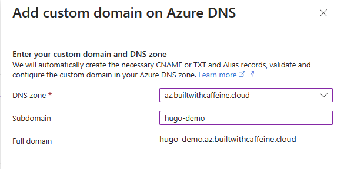

Grab a quick drink while we wait for DNS validation to complete.


Next we need to change the default domain to be the custom domain. This can be done from the Configuration tab, under the Domain section.

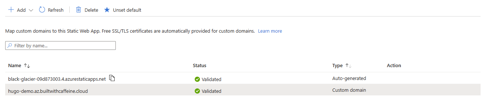

And finally, we can check the static web app using the custom domain.

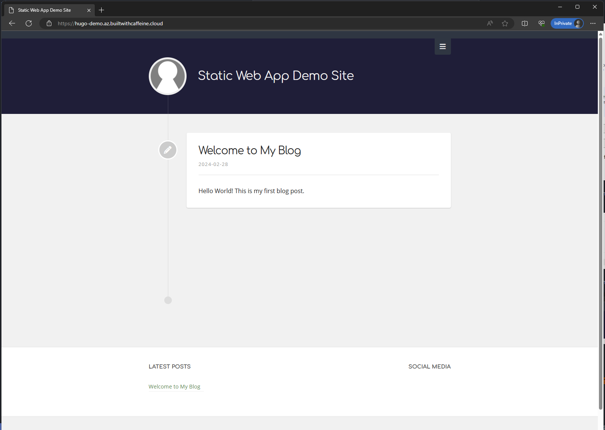

# Conclusion

In conclusion, we've successfully set up a Static Web App complete with a personalized domain, leveraging the power of Hugo as our framework and GitHub for seamless source control. While this tutorial provided a foundational understanding of starting a blog, there's a vast landscape of possibilities awaiting exploration.

This is just the tip of the iceberg with Hugo; there's so much more we can delve into, including incorporating features like comments, integrating Google Analytics for insightful data, mastering content tagging, and even giving your site a unique flair by customizing the theme. The journey of building your blog is an ongoing adventure, and I'm confident this guide has equipped you with the essentials to embark on it.

Remember, every step you take in expanding your site's functionalities adds depth and character to your online presence. So, stay curious, keep experimenting, and let your creativity flow. Until next time, happy blogging!
