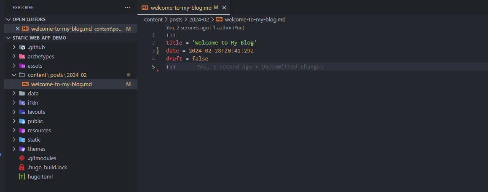
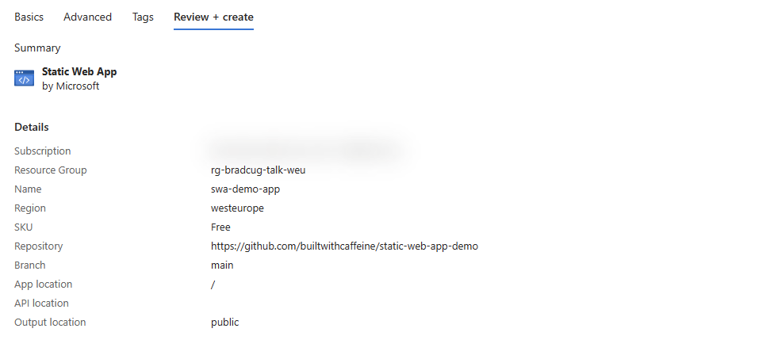

# Getting Starting with Azure Blogging

> [!WARNING]
> This guide assumes the Git is already installed locally.

### Introduction - Installing GoHugo Framework
Firstly we need to ensure that the Hugo Framwork is installed on your local machine. This is a static site generator that will allow us to create a blog site that can be hosted on Azure. to do this we can use the following command:

### For Windows
```
winget install -e Hugo.Hugo.Extended
```

### For Linux 
```
sudo apt install hugo
```

Once we have installed Hugo, next we need to create a GitHub Repository to store our Hugo site. We will be using this repository to deploy our site to Azure Static Web Apps.  So to [Github](https://github.com)!

## Create a GitHub Repository


Once the repository has been created we can then clone the new repo to the local machine.


> For this example the working directory will be C:\Code \
to create this folder using powershell we can use the following command:
```powershell
New-Item -ItemType 'Directory' -Path 'C:\Code'
Set-location -Path 'C:\Code'
```

Execute Git Clone! 
> This will create a local folder inside of C:\Code called static-web-app
```
git clone https://github.com/builtwithcaffeine/static-web-app-demo.git
```

### Initialise Hugo Framework  
[Hugo :: Quick Start Help](https://gohugo.io/getting-started/quick-start/)

> From the working directory C:\Code 

```
hugo new site static-web-app-demo -d .\static-web-app-demo --force
```

Example of new site creation.


So, we technically have a site deployed, However if you were to look at it from your local machine it would'nt look very nice. First we need to change the local directory to be inside the hugo site. 

```
Set-location -Path 'C:\Code\static-web-app-demo'
```

Then Launch the Hugo Server
```
hugo server
``````


Open a web browser and nativate to [http://localhost:1313](http://localhost:1313)

As I said, It's not very pretty. So lets add a theme to the site.


### Customising the Hugo with a Theme.
[Hugo :: Themes](https://themes.gohugo.io/) \
[Bilberry Theme :: GitHub](https://github.com/Lednerb/bilberry-hugo-theme) 

For this example I'm going to demonstrate how to use the [bilberry-hugo-theme](https://themes.gohugo.io/themes/bilberry-hugo-theme/) theme. 

First we need to stop the local Hugo Server instance. `CTRL + C` \
From the Bilberry Git Repo, We are going to use Install Method #2 `Git SubModule` 

Ensure that you are in the correct working directory, This should be: 

```
Set-Location -Path 'C:\Code\static-web-app-demo
```

Now we can clone the theme into the Static Web App folder.
```
git submodule add https://github.com/Lednerb/bilberry-hugo-theme.git themes/bilberry-hugo-theme
```


Once the theme has been downloaded we need to update the hugo.toml file to use the new theme. 

A default hugo.toml file would look like

```toml
baseURL = 'https://example.org/'
languageCode = 'en-us'
title = 'My New Hugo Site'
```

An updated hugo.toml file would look like

```toml
baseURL = 'https://demo-web-app.builtwithcaffeine.cloud'
languageCode = 'en-us'
title = 'Static Web App Demo Site'
theme = "bilberry-hugo-theme/v4"
```

Now lets check the site again 

```
hugo server
```


Open a web browser and nativate to [http://localhost:1313](http://localhost:1313)


### Content Creation Time! 
So hugo has two options for content creation. Either Pages or Posts.
There is some really good documentation provided from Hugo on Content creation and organisation, which can be found here > [Click Me!](https://gohugo.io/content-management/organization/)

```
.
└── content
    └── about
    |   └── index.md  // <- https://example.org/about/
    ├── posts
    |   ├── firstpost.md   // <- https://example.org/posts/firstpost/
    |   ├── happy
    |   |   └── ness.md  // <- https://example.org/posts/happy/ness/
    |   └── secondpost.md  // <- https://example.org/posts/secondpost/
    └── quote
        ├── first.md       // <- https://example.org/quote/first/
        └── second.md      // <- https://example.org/quote/second/
```
^ this snippet has been taken direct from the Hugo Website, Just for reference.

So from a VSCode perspective, this is how I personally like to organise my content. 


### Creating a new post
To create a new post we can use the following command:
```
hugo new posts/2023-11/welcome-to-my-blog.md
```


This will create a new post in the posts folder, with the date and title of the post.


## Pre-Azure step - commit to GitHub

Ok! So we have the sample site ready to use, now we need to commit the changes to GitHub. Ensure that the hugo site is not running locally `CTRL + C` and then we can commit the changes to GitHub.

```
git add * && git commit -m "Static Web App Upload" && git push
```


## Creating the Azure Static Web App
Now that we have a Hugo site, we can now create the Azure Static Web App.
From the Azure portal, we need to create a resource group which will contain the Static Web App and later on the DNS Zone for the website.


This is the important part, If you get these settings wrong the site wont deploy.
For this example we are going to use GitHub as the source control, and the repository we created earlier in this guide. and the Build Preset will be Hugo. 


Pre-Flight checks, before the static web app is deployed to Azure.



As we can see here the deployment of the Static Web App is super fast and has only taken a couple of miuntes to complete.


Once the Static Web App has been created it pushed a yaml file to the GitHub repository which contains the build and deployment instructions for the site.
You can view this under the GitHub Action tab within the repository.


From here we can see the intial action has completed and the site has been deployed.


